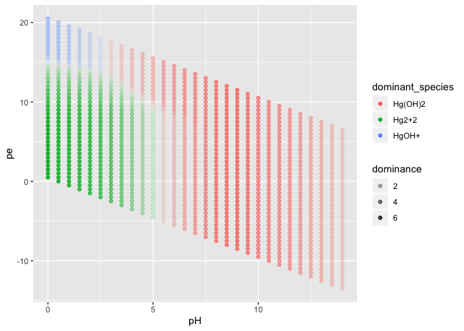

<!-- README.md is generated from README.Rmd. Please edit that file -->

# tidyphreeqc

The goal of tidyphreeqc is to provide a more useful interface to the
existing phreeqc package.

## Installation

You can install tidyphreeqc from github with:

``` r
# install.packages("devtools")
devtools::install_github("paleolimbot/tidyphreeqc")
```

## Example

Running PHREEQC is accomplished using the `phr_run()` function, which
calls the program and generates the output. The function accepts
character vectors of input, which can be generated using intput helper
functions such as `phr_solution()`, `phr_selected_output()`,
`phr_equilibrium_phases()`, and `phr_reaction_temperature()` (or roll
your own input using `phr_input_section()`).

``` r
library(tidyphreeqc)
phr_run(
  phr_solution(pH = 7, temp = 25)
)
#> <phr_run_output>
#> PHREEQC run with 0 selected output(s)
#> Raw output at '/var/folders/bq/2rcjstv90nx1_wrt8d3gqw6m0000gn/T//RtmpRGU6OE/file139659a589e3'
```

To get the results as a data frame, we need to supply a
`phr_selected_output()` to the input file.

``` r
phr_run(
  phr_solution(pH = 7, temp = 25),
  phr_selected_output(pH = TRUE, temp = TRUE, activities = c("OH-", "H+", "O2"))
)
#> <phr_run_output>
#> PHREEQC run with 1 selected output(s)
#> Raw output at '/var/folders/bq/2rcjstv90nx1_wrt8d3gqw6m0000gn/T//RtmpRGU6OE/file139665a0f7f9'
#> as_tibble():
#> # A tibble: 1 x 13
#>   selected_output   sim state  soln dist_x  time  step    pH    pe
#>   <chr>           <int> <chr> <int>  <dbl> <dbl> <int> <dbl> <dbl>
#> 1 n1                  1 i_so…     1     NA    NA    NA     7     4
#> # … with 4 more variables: `temp(C)` <dbl>, `la_OH-` <dbl>, `la_H+` <dbl>,
#> #   la_O2 <dbl>
```

To find the distribution of a few solutions, you can generate a list of
solutions using `phr_solution_list()`.

``` r
phr_run(
  phr_solution_list(pH = 5:8, temp = 12:25),
  phr_selected_output(pH = TRUE, temp = TRUE, activities = c("OH-", "H+", "O2"))
)
#> <phr_run_output>
#> PHREEQC run with 1 selected output(s)
#> Raw output at '/var/folders/bq/2rcjstv90nx1_wrt8d3gqw6m0000gn/T//RtmpRGU6OE/file1396c3c1253'
#> as_tibble():
#> # A tibble: 56 x 13
#>    selected_output   sim state  soln dist_x  time  step    pH    pe
#>    <chr>           <int> <chr> <int>  <dbl> <dbl> <int> <dbl> <dbl>
#>  1 n1                  1 i_so…     1     NA    NA    NA     5     4
#>  2 n1                  1 i_so…     2     NA    NA    NA     6     4
#>  3 n1                  1 i_so…     3     NA    NA    NA     7     4
#>  4 n1                  1 i_so…     4     NA    NA    NA     8     4
#>  5 n1                  1 i_so…     5     NA    NA    NA     5     4
#>  6 n1                  1 i_so…     6     NA    NA    NA     6     4
#>  7 n1                  1 i_so…     7     NA    NA    NA     7     4
#>  8 n1                  1 i_so…     8     NA    NA    NA     8     4
#>  9 n1                  1 i_so…     9     NA    NA    NA     5     4
#> 10 n1                  1 i_so…    10     NA    NA    NA     6     4
#> # … with 46 more rows, and 4 more variables: `temp(C)` <dbl>,
#> #   `la_OH-` <dbl>, `la_H+` <dbl>, la_O2 <dbl>
```

## Databases

Some elements (for example, mercury) aren’t included in the base
database. There are a number of databases included in the PHREEQC
package, that you can choose by specifying the `db` argument of
`phr_run()`. One that includes mercury is the “minteq” database.

``` r
phr_run(
  phr_solution(pH = 7, temp = 25, Hg = 0.1),
  phr_selected_output(
    activities = c("Hg", "Hg2+2", "Hg(OH)2", "Hg(OH)2", "HgOH+", "Hg(OH)3-")
  ),
  db = "minteq"
)
#> <phr_run_output>
#> PHREEQC run with 1 selected output(s)
#> Raw output at '/var/folders/bq/2rcjstv90nx1_wrt8d3gqw6m0000gn/T//RtmpRGU6OE/file139623b20a7e'
#> as_tibble():
#> # A tibble: 1 x 14
#>   selected_output   sim state  soln dist_x  time  step    pH    pe la_Hg
#>   <chr>           <int> <chr> <int>  <dbl> <dbl> <int> <dbl> <dbl> <dbl>
#> 1 n1                  1 i_so…     1     NA    NA    NA     7     4 -4.00
#> # … with 4 more variables: `la_Hg2+2` <dbl>, `la_Hg(OH)2` <dbl>,
#> #   `la_HgOH+` <dbl>, `la_Hg(OH)3-` <dbl>
```

## Pourbaix diagrams

``` r
result <- phr_run(
  phr_solution_list(pH = seq(0, 14, 0.5), pe = seq(-14, 22, 0.5), Hg = 0.1),
  phr_selected_output(
    activities = c("Hg", "Hg2+2", "Hg(OH)2", "Hg(OH)2", "HgOH+", "Hg(OH)3-")
  ),
  db = "minteq"
)

result
#> <phr_run_output>
#> PHREEQC run with 1 selected output(s)
#> Raw output at '/var/folders/bq/2rcjstv90nx1_wrt8d3gqw6m0000gn/T//RtmpRGU6OE/file13961b026c07'
#> as_tibble():
#> # A tibble: 1,189 x 14
#>    selected_output   sim state  soln dist_x  time  step    pH    pe la_Hg
#>    <chr>           <int> <chr> <int>  <dbl> <dbl> <int> <dbl> <dbl> <dbl>
#>  1 n1                  1 i_so…     1     NA    NA    NA  14   -13.5 -3.92
#>  2 n1                  1 i_so…     2     NA    NA    NA  13.5 -13   -3.98
#>  3 n1                  1 i_so…     3     NA    NA    NA  14   -13   -3.92
#>  4 n1                  1 i_so…     4     NA    NA    NA  13   -12.5 -3.99
#>  5 n1                  1 i_so…     5     NA    NA    NA  13.5 -12.5 -3.98
#>  6 n1                  1 i_so…     6     NA    NA    NA  14   -12.5 -3.92
#>  7 n1                  1 i_so…     7     NA    NA    NA  12.5 -12   -4.00
#>  8 n1                  1 i_so…     8     NA    NA    NA  13   -12   -3.99
#>  9 n1                  1 i_so…     9     NA    NA    NA  13.5 -12   -3.98
#> 10 n1                  1 i_so…    10     NA    NA    NA  14   -12   -3.92
#> # … with 1,179 more rows, and 4 more variables: `la_Hg2+2` <dbl>,
#> #   `la_Hg(OH)2` <dbl>, `la_HgOH+` <dbl>, `la_Hg(OH)3-` <dbl>
```

``` r
library(tidyverse)
#> Registered S3 method overwritten by 'rvest':
#>   method            from
#>   read_xml.response xml2
#> ── Attaching packages ───────────────────────────────────────────────────────────────────── tidyverse 1.2.1 ──
#> ✔ ggplot2 3.2.1     ✔ purrr   0.3.2
#> ✔ tibble  2.1.3     ✔ dplyr   0.8.1
#> ✔ tidyr   0.8.3     ✔ stringr 1.4.0
#> ✔ readr   1.3.1     ✔ forcats 0.4.0
#> ── Conflicts ──────────────────────────────────────────────────────────────────────── tidyverse_conflicts() ──
#> ✖ dplyr::filter() masks stats::filter()
#> ✖ dplyr::lag()    masks stats::lag()
result_long <- result %>%
  as_tibble() %>%
  gather(key = "species", value = "log_activity", starts_with("la_")) %>%
  mutate(species = str_remove(species, "^la_"))

result_long %>%
  ggplot(aes(x = pH, y = pe, fill = log_activity)) +
  geom_raster() +
  stat_contour(aes(z = log_activity)) +
  facet_wrap(~species)
```

<!-- -->

``` r

result_long %>%
  filter(species != "Hg") %>%
  group_by(pH, pe) %>%
  summarise(
    dominant_species = species[which.max(log_activity)],
    dominant_log_act = max(log_activity),
    dominance = max(log_activity) - max(setdiff(log_activity, max(log_activity)))
  ) %>%
  ggplot(aes(pH, pe, col = dominant_species, alpha = dominance)) +
  geom_point()
```

<!-- -->
